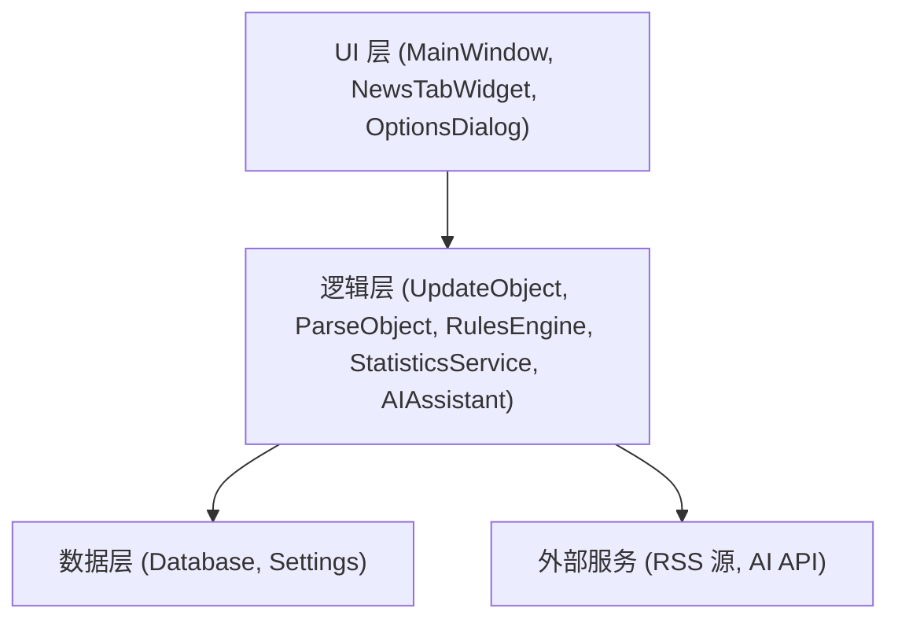
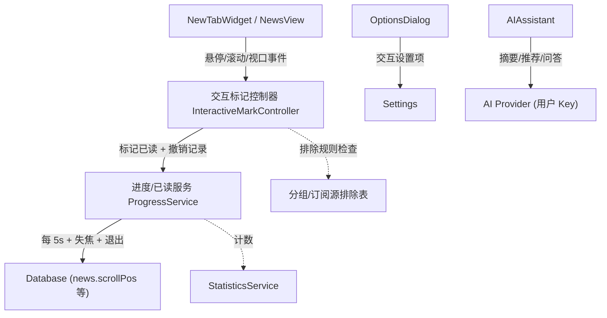

# Codex 桌面端 UI 重构与功能优化 - 技术设计

Feature Name: 2026-08-13-codex-ui-refresh
Updated: 2026-08-13

## Description

将现有 Qt/C++ RSS 阅读器界面重构为 Codex 桌面端视觉风格，并新增阅读进度自动保存、交互式标记已读、设置模块整合、订阅源管理增强、AI 助手、规则引擎增强与阅读统计。开发优先级：UI 重构 → 阅读进度保存 → 设置整合 → 订阅管理 → 统计 → 规则引擎 → AI 模块。

技术决策（已与用户确认）：
1. AI 模块纳入完整设计，API Key 由用户在设置页自行配置。
2. UI 重构采用彻底替换策略：废弃既有 8 套 QSS 主题，仅保留 Codex 风格浅色/深色两套。
3. 数据库版本从 17 升至 18，通过 `ALTER TABLE`/`CREATE TABLE` 迁移，兼容旧库。

## Architecture

### 总体分层



现有代码按 MVC 组织（Model = feeds/news 表 + 内存模型，View = QTreeView 系，Controller = MainWindow/UpdateObject）。本次改动在既有骨架上扩展，不重写架构。

### 关键设计点



## Components and Interfaces

### 1. Codex 主题系统

- 新增 `style/codex_light.qss`、`style/codex_dark.qss`，资源注册进 `Quill.qrc`。
- `MainWindow::setStyleApp`（mainwindow.cpp:6188）重构：
  - 移除 8 套旧主题分支，仅保留 codex_light/codex_dark/system 跟随三态。
  - `Settings/styleApplication` 旧值（system/system2/dark/orange/purple/pink/gray/green）在加载时归一化：dark 系 → codex_dark，其余 → codex_light。
- 系统主题跟随：监听 `QApplication` 的平台主题变化（Qt 6.5+ `QPalette` 变化 / `platformTheme`），或通过 `QSettings` 轮询；浅/深判定用 `qApp->palette().color(QPalette::Window).lightness()` 阈值 128。
- 深色下新闻内容页继续使用 `web_dark.css` 逻辑（mainwindow.cpp:6251）。
- 圆角/阴影/间距：通过 QSS 定义（如 `QTreeView{border-radius:...}`）；阴影仅在主窗口/弹窗边缘绘制（`QGraphicsDropShadowEffect` 或窗口边框绘制），避免每个 widget 开销。

### 2. 阅读进度自动保存

**新组件 `ProgressService`**（新文件 `src/progress/progressservice.h/cpp`）：
- 维护当前阅读上下文：`feedId`、`newsId`、滚动偏移 `scrollPos`、`lastReadTime`。
- 定时器 `QTimer` 每 5s 触发 `saveProgress()`（仅当上下文自上次保存后变化）。
- 接口：
  - `updateContext(feedId, newsId, scrollPos)`：随新闻列表选中/滚动事件调用。
  - `flush()`：立即写入。
- 数据库写入：新增 `news.scrollPos integer`、`news.lastReadTime varchar` 字段（迁移见 Data Models）。
- 事件绑定：
  - 列表滚动：`NewsView` 重写 `scrollContentsBy()`（newsview.cpp）→ 通知 `ProgressService::updateContext`，同时触发交互标记控制器的"滚动出屏"检测。
  - 标签页切换：`NewsTabWidget::currentChanged`（newstabwidget）→ `ProgressService::flush()`。
  - 窗口失焦：`MainWindow::eventFilter` 捕获 `QEvent::WindowDeactivate` → `flush()`。
  - 退出：`MainWindow::quitApp`（mainwindow.cpp:149）→ `flush()`。
- 恢复：打开订阅源时（mainwindow.cpp:3276 现有 `currentNews` 定位逻辑）额外读取 `scrollPos` 恢复滚动偏移。

### 3. 设置模块整合

**OptionsDialog 结构调整**（optionsdialog.cpp:64 的 11 tab 结构）：
- 保留 General / System Tray / Network / Language / Fonts&Colors / Keyboard Shortcuts 分类。
- 新增 tab：
  - **交互设置（Interaction）**：悬停标记、滚动出屏标记、视口标记三个独立复选框；每项延迟下拉（0.5s/1s/2s）；排除规则按钮（弹分组/订阅源多选）；"撤销最近一次批量标记"入口。
  - **自动清理（Cleanup）**：启用开关；策略单选（按时间 N 天默认 30 / 按数量保留 N 篇）；回收站保留天数（默认 7）。
  - **AI（独立页）**：API Key（密码框，用户自填）、模型下拉、摘要长度、对话历史保留策略、离线缓存开关。
  - **统计（独立页）**：指标卡片 + 趋势图 + 导出按钮。
- 新增配置键（存 `Settings` 组）：
  - `Interaction/hoverMarkRead`、`Interaction/hoverMarkDelay`、`Interaction/scrollMarkRead`、`Interaction/viewportMarkRead`、`Interaction/markExcludeOnlyStarred`
  - `Interaction/excludedGroups`、`Interaction/excludedFeeds`（分号分隔 ID 列表）
  - `Cleanup/enabled`、`Cleanup/strategy`（time|count）、`Cleanup/days`、`Cleanup/keepCount`、`Cleanup/recycleDays`
  - `AI/enabled`、`AI/apiKey`、`AI/model`、`AI/summaryLength`、`AI/historyRetention`、`AI/offlineCache`
- API Key 仅以占位符 `.env.example` 示例，代码中读 `Settings` 组 `AI/apiKey`（用户填入），不得引用 Agent 运行环境变量。

### 4. 订阅源管理增强

- **JSON 备份/恢复**：新增 `src/importexport/jsonfeeds.h/cpp`，复用现有 OPML 导入路径（updatefeeds.cpp:359）的解析后处理（保留层级、去重、写 feeds 表）。
  - 导出（mainwindow.cpp:2765 旁新增 `slotExportFeedsJson`）：QJsonObject 含 name、xmlUrl、htmlUrl、parentId、updateInterval*、sort 等元数据。
  - 导入（新增 `slotImportFeedsJson`）：校验 JSON 合法性与结构；根据用户选择覆盖或合并（去重键 = xmlUrl 小写）。
- **订阅源管理列表**：新增 `FeedsManagementDialog`（新文件 `src/feedsmanagement/`）：
  - 表格列：名称/分组/更新时间/更新频率/状态（正常/失效/暂停，由 `status` 字段与最近更新推断）。
  - 排序：点击表头切换（名称/分类/更新时间/频率/状态）。
  - 多选操作复用现有 `deleteItemFeedsTree`（mainwindow.cpp:2640）、`FeedPropertiesDialog` 批量应用（mainwindow.cpp:5626）与分组移动逻辑。
- 现有 OPML 导入导出保持不变。

### 5. AI 助手模块

**新组件 `AIAssistant`**（新文件 `src/ai/aiassistant.h/cpp`）：
- 入口：侧边栏顶部新增按钮（mainwindow.cpp 创建），触发 `AIDialog`（新文件 `src/ai/aidialog.h/cpp`）。
- `AIDialog` 布局：左侧对话列表（本地记录）、右侧对话区（消息气泡）、输入框；工具栏含"摘要当前文章""推荐文章"快捷按钮。
- Provider 抽象：`AIAssistant` 内部封装 HTTP 请求（`QNetworkAccessManager`），支持 OpenAI 兼容接口；Base URL 由设置页配置。请求体为 JSON（`QJsonObject`），响应解析 `choices[0].message.content`。
- 上下文注入：请求时附加当前文章标题与正文（截断至模型上下文上限，`AI/contextLength`）。
- 对话历史：本地存 `dialog` 表（见 Data Models），保留策略 `AI/historyRetention`（如保留最近 N 条 / 全部）。
- 统计计数：对话与摘要生成各记一次，写入统计表。
- 网络错误/超时：显示友好错误，不崩溃；API Key 缺失时提示用户到设置页配置。
- **安全约束**：API Key 只存在于 `Settings` 组（用户填入）与内存，日志与 UI 均不展示；不使用 Agent 环境变量。

### 6. 规则模块

在现有 filters/filterConditions/filterActions 基础上扩展（保持向后兼容）：
- 条件类型扩展：`filterConditions.condition` 增加枚举（关键词标题、关键词正文、来源订阅源、发布时间范围、已读/收藏/稍后阅读状态）；现有 contains/regExp 保留。
- 动作类型扩展：`filterActions.action` 增加枚举（标未读、移入分类、回收站删除、AI 摘要保存）；现有动作保留。
- UI：`FilterRulesDialog`（src/newsfilters/）增加新条件/动作编辑控件与优先级排序（复用 `num` 字段）、启用/禁用（`enable` 字段）、实时命中预览（对当前选中 feed 的 news 模拟执行）。
- 执行器：`ParseObject::runUserFilter`（parseobject.cpp:995）扩展新动作分发；新动作 `移入分类` = 更新 `category`；`回收站删除` = 置 `deleted=1` + 写 `deleteDate`；`AI 摘要` = 调用 `AIAssistant`（异步，失败不阻塞解析）。

### 7. 统计模块

**新组件 `StatisticsService`**（新文件 `src/statistics/statistics.h/cpp`）：
- 数据表 `stats`（见 Data Models），按日期+事件类型聚合计数。
- 事件来源埋点：
  - 订阅源刷新完成：`ParseObject::signalFinishUpdate`（parseobject.cpp）→ 记 `feed_refresh`。
  - 标记已读（含交互式）：`ProgressService`/现有置读路径 → 记 `news_read`。
  - 查看文章：`NewsTabWidget::slotNewsViewSelected`（newstabwidget.cpp:684）→ 记 `news_view`。
  - 收藏：现有收藏动作 → 记 `news_star`。
  - AI 对话/摘要：`AIAssistant` → 记 `ai_chat` / `ai_summary`。
- 统计页（`StatisticsDialog`，新文件 `src/statistics/statisticsdialog.h/cpp`）：
  - 时间范围控件：总计 / 近 7 天 / 近 30 天 / 按周（前后翻页）/ 自定义起止。
  - 卡片显示 6 项指标；折线图用 `QCustomPlot`（3rdparty 引入）或 `Qt Charts`（若可用），每周阅读量趋势。
  - 导出：CSV（QTextStream 写逗号转义）与 JSON。

### 8. 交互式标记已读（悬停/滚动/视口）

**新组件 `InteractiveMarkController`**（新文件 `src/newsview/interactivemark.h/cpp`）：
- 由 `NewsTabWidget` 创建，持有 `NewsView`、`ProgressService` 引用与 `Settings` 配置。
- **悬停标记**：`NewsView` 开启 `setMouseTracking(true)`，重写 `mouseMoveEvent` 记录当前 hover 行；Controller 启动单发 `QTimer(delay)`，到点后若行未变化且非稍后阅读列表 → 标记已读。
- **滚动出屏标记**：重写 `scrollContentsBy` 收集滚动后完全移出可视区域的行（`visualRect(row).top() < 0 || bottom() > viewportHeight`），非稍后阅读列表 → 标记已读。支持批量一次写入（单事务），并记录被标记行集合供撤销。
- **视口标记**：新内容首次进入视口时（模型插入新行且 `visualRect` 与视口相交）→ 立即标记已读；可选仅对非收藏/非稍后阅读内容生效。
- **稍后阅读隔离**：判断当前模型是否属于稍后阅读视图（内部收藏/标签过滤视图），是则跳过全部自动标记。
- **撤销**：Controller 维护最近一次批量标记的行 id 列表；"撤销"按钮 → 恢复 `read=0`（对仍未被用户手动改动的行）。
- **排除规则**：标记前检查该行所属 feed/分组是否在 `Interaction/excludedGroups`、`Interaction/excludedFeeds` 中。
- **性能**：批量标记走单事务（`db.transaction()`），行级操作批量拼 `UPDATE news SET read=1 WHERE id IN (...)`，满足 200ms 内完成。

### 9. 可选增强项

- **全局快捷键**：引入 `QxtGlobalShortcut`（3rdparty）或平台原生（Win `RegisterHotKey`、Linux `X11`/`wayland` 受限）实现；`Ctrl+S` → `ProgressService::flush()`，`Ctrl+Shift+A` → 唤起 `AIDialog`。注：Wayland 下全局快捷键受限，退化为应用内快捷键。
- **进度云同步 / 离线阅读 / 智能清理建议**：纳入后续迭代，本次设计保留接口占位（`ProgressService::sync()` 空实现、`AIAssistant` 离线缓存标志、`CleanupService` 磁盘空间检查回调）。

## Data Models

### 数据库迁移（version 17 → 18）

```sql
-- news 表新增字段
ALTER TABLE news ADD COLUMN scrollPos integer default 0;
ALTER TABLE news ADD COLUMN lastReadTime varchar;
ALTER TABLE news ADD COLUMN lastViewTime varchar;      -- 查看文章计数去重辅助

-- 回收站（复用 deleted/deleteDate 字段，无需新表）
-- 已存在：deleted integer, deleteDate varchar

-- 统计表（新建）
CREATE TABLE IF NOT EXISTS stats(
  id integer primary key,
  date varchar,              -- YYYY-MM-DD
  type varchar,              -- feed_refresh|news_read|news_view|news_star|ai_chat|ai_summary
  count integer default 0
);
CREATE INDEX IF NOT EXISTS idx_stats_date_type ON stats(date, type);

-- AI 对话记录（新建）
CREATE TABLE IF NOT EXISTS dialog(
  id integer primary key,
  date varchar,
  feedId integer,
  newsId integer,
  role varchar,              -- user|assistant
  content varchar
);

-- 排除规则（新建，或复用现有分组/订阅源标识）
CREATE TABLE IF NOT EXISTS excludeAutoMark(
  id integer primary key,
  type varchar,              -- group|feed
  targetId integer
);
```

迁移逻辑在 `Database::prepareDatabase` 的 `dbVersion < 18` 分支（database.cpp:313-348 模式）执行，并同步创建索引。

### 配置键（Settings 组）

见 Components 第 3 节配置键清单。

## Correctness Properties

1. 阅读进度保存 SHALL 具备幂等性：重复保存相同上下文不产生重复记录。
2. 交互式标记已读 SHALL 保持与手动标记一致的事务语义（批量单事务）。
3. 撤销操作 SHALL 仅回滚本次会话内自动标记且未被用户后续改动的行。
4. 排除规则 SHALL 优先于交互式标记规则。
5. 稍后阅读列表 SHALL 豁免全部交互式自动标记。
6. 统计计数 SHALL 按日聚合、事件幂等（同一文章同一日查看多次按约定计数策略：查看次数累加，读次按首次置读计 1）。
7. 主题归一化映射 SHALL 保持确定性（旧值 → 固定 Codex 主题）。
8. DB 迁移 SHALL 可在已存在 17 版旧库上重复执行且不丢数据。
9. AI 调用失败（网络/鉴权/超时）SHALL 不阻塞订阅解析主流程。

## Error Handling

| 场景 | 处理 |
|------|------|
| AI API Key 未配置 | 对话窗口提示引导到设置页，不发起请求 |
| AI 请求失败/超时 | 消息区显示错误文案与重试按钮，解析流程不受影响 |
| JSON 导入文件损坏 | 对话框报错，不改动现有订阅 |
| DB 迁移失败 | 回滚事务，保留旧库备份（复用 `Common::createFileBackup`，database.cpp:309） |
| 磁盘空间不足 | 智能清理建议弹窗，触发清理向导 |
| 全局快捷键注册失败（Wayland） | 静默退化为应用内快捷键 |

## Test Strategy

环境无 Qt 工具链，采用"无编译环境的静态审查 + 逻辑等价性验证"策略：

1. **DB 迁移**：编写迁移 SQL 的等价性检查（字段存在性、索引命中），对照 `explain query plan` 验证 `news(feedId, deleted)`、`news(scrollPos)` 等索引被使用。
2. **交互式标记**：用 Qt 单元测试框架（若引入）或手动用例验证：悬停延迟、滚动出屏行集合计算、视口首次进入、稍后阅读豁免、排除规则、撤销回滚。
3. **进度保存**：验证 5s 定时、失焦/切页/退出触发、scrollPos 恢复。
4. **主题归一化**：8 个旧值 → 2 个新值的映射表单测。
5. **统计聚合**：同事件同日多条 → 计数正确；导出 CSV/JSON 可被解析回读。
6. **AI 模块**：mock HTTP 层验证请求体构造、错误路径、Key 不泄露。
7. **回归**：现有 OPML 导入导出、用户过滤器执行路径（parseobject.cpp:995）不因扩展破坏。

## References

[^1]: (Website) - [Qt Documentation: Stylesheet Reference](https://doc.qt.io/qt-6/stylesheet-reference.html)
[^2]: (File) - `src/optionsdialog.cpp` - 现有 11 tab 设置对话框结构（optionsdialog.cpp:64）
[^3]: (File) - `src/mainwindow.cpp` - `setStyleApp` 主题加载（mainwindow.cpp:6188）、`quitApp`（mainwindow.cpp:149）
[^4]: (File) - `src/newstabwidget.cpp` - 新闻列表视图与标记已读触发（newstabwidget.cpp:684-731）
[^5]: (File) - `src/newsview/newsview.h` - `NewsView : public QTreeView`（newsview.h:29）
[^6]: (File) - `src/database/database.cpp` - DB 版本 17 与迁移模式（database.cpp:29, 310-353）
[^7]: (File) - `src/updatefeeds.cpp` - OPML 导入（updatefeeds.cpp:359）、`ParseObject::runUserFilter`（parseobject.cpp:995）
